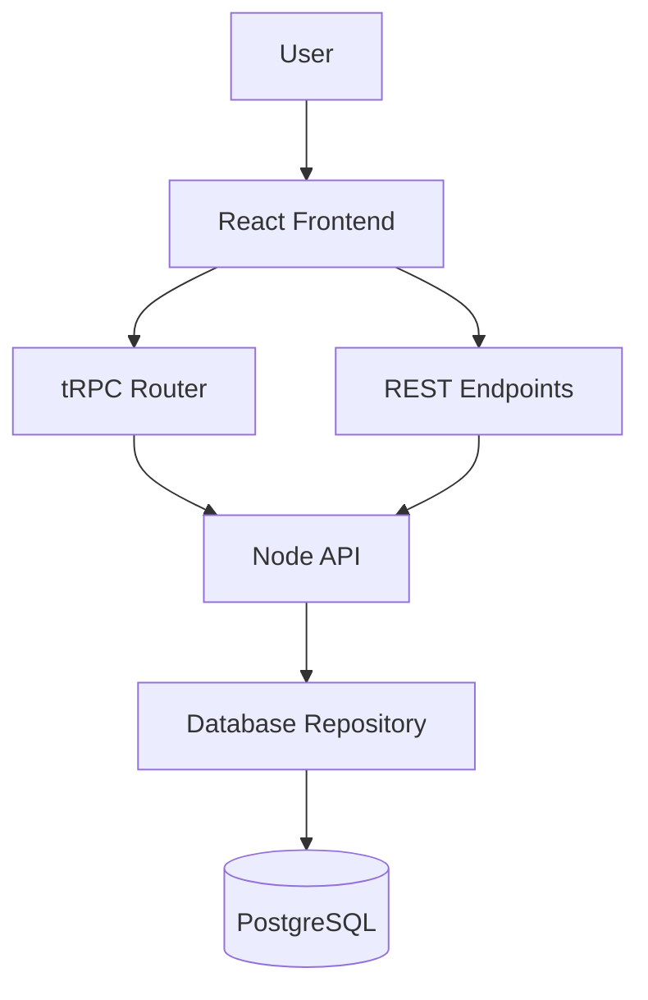
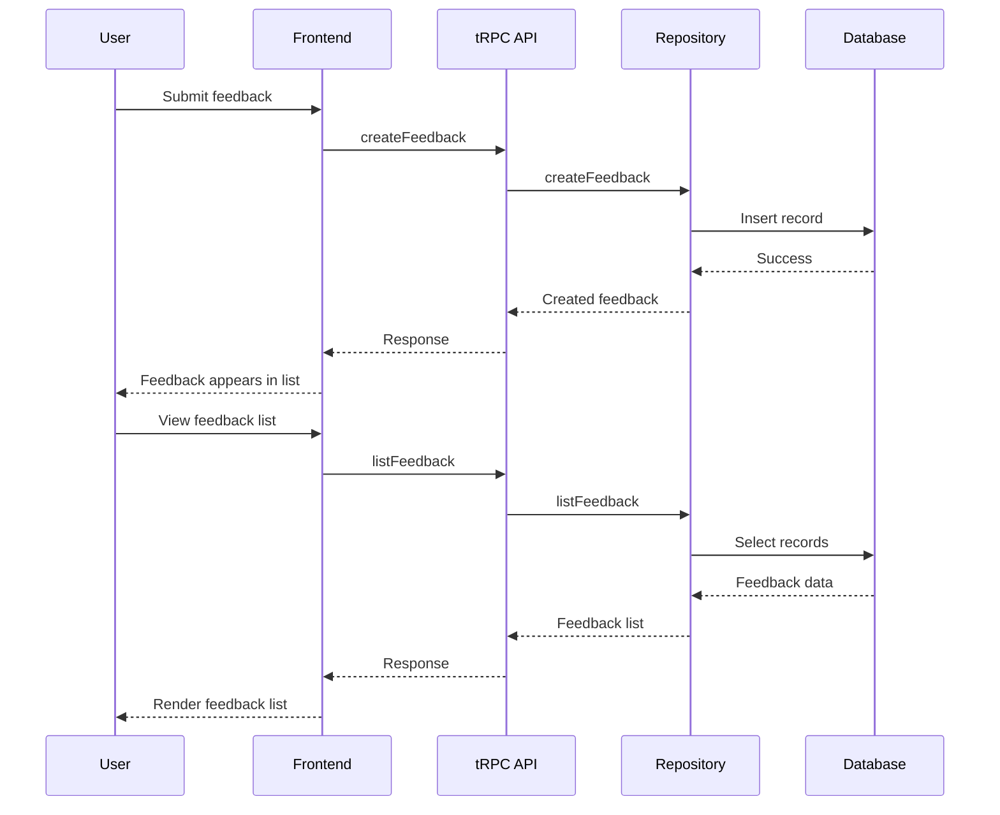

## Project Overview

This project is a simple feedback board application built to demonstrate a clean and extensible full stack architecture.

It provides a basic feedback flow with creation, listing, updating, and deletion, backed by a Node and TypeScript API and a PostgreSQL database.

The codebase is intentionally kept small, with a strong focus on separation of concerns, predictable data flow, and maintainability, making it suitable as a foundation for further features and iterations.

## User Stories

The application is designed around a small set of core user stories that define the primary feedback workflow.

### View Feedback

As a user, I want to view a list of submitted feedback so that I can see existing entries and understand the current state of feedback.

**Acceptance criteria**

- Feedback entries are displayed in a list
- The list updates after create, update, or delete actions
- Empty states are handled clearly when no feedback exists

### Create Feedback

As a user, I want to submit new feedback so that my input can be recorded and reviewed.

**Acceptance criteria**

- A form is provided to enter feedback details
- Required fields are validated before submission
- After submission, the feedback appears in the list

### Update Feedback

As a user, I want to edit existing feedback so that I can correct or refine my input.

**Acceptance criteria**

- Existing feedback can be selected for editing
- The form is pre-populated with the current feedback values
- Changes are saved and reflected in the list

### Delete Feedback

As a user, I want to delete feedback so that outdated or incorrect entries can be removed.

**Acceptance criteria**

- Users are prompted to confirm deletion
- Deleted feedback is removed from the list
- The UI updates immediately after deletion

## Tech Stack

### Frontend

- React
- TypeScript
- Vite
- Tailwind CSS
- React Router
- tRPC Client
- TanStack React Query

### Backend

- Node.js
- TypeScript
- Express
- tRPC
- PostgreSQL
- Drizzle ORM

### Tooling

- pnpm workspace (monorepo)
- Docker Compose (local PostgreSQL)

## Repository Structure

The project is organised as a pnpm workspace monorepo to clearly separate frontend, backend, and database concerns while keeping development and tooling consistent.

```
apps/
  api/        # Backend application (Node, Express, tRPC)
  web/        # Frontend application (React, Vite)
packages/
  db/         # Database schema, migrations, and repository layer

```

### apps/api

Contains the backend application responsible for handling HTTP requests, API routing, and business logic.

The API exposes both REST endpoints and tRPC routers. This allows the backend to support different communication patterns while keeping the core domain logic isolated from transport concerns.

### apps/web

Contains the frontend React application.

The UI communicates with the backend primarily through tRPC using shared type definitions, enabling end-to-end type safety. Client side routing is implemented to support multiple pages and future feature expansion.

### packages/db

Contains the database layer, including the Drizzle schema, migrations, and repository functions.

By extracting database logic into a separate package, the data access layer remains independent from the API framework and can be reused or tested in isolation.

### Why a monorepo

Using a monorepo simplifies local development and encourages clear ownership boundaries between layers while still allowing shared types and utilities where appropriate.

This structure makes it easier to reason about the system as a whole and supports incremental growth without large refactors.

## Local Development Setup

### Prerequisites

- Node.js
- pnpm
- Docker
- Docker Compose

### Installation

Install all dependencies from the repository root.

```
pnpm install
```

### Environment Variables

Create a `.env` file in the repository root.  
An example file is provided to document the required environment variables.

The database connection should point to the local PostgreSQL instance started via Docker Compose.

### Running the Database

Start the local PostgreSQL database using Docker Compose.

```
docker compose up
```

### Running the Applications

Start both the frontend and backend in development mode from the repository root.

```
pnpm dev
```

This command starts:

- the backend API
- the frontend React application

Each application runs in its own workspace while sharing the same development environment.

### Why This Setup

A single command driven workflow keeps local development simple and predictable, making it easy to iterate quickly and extend the project with additional features.

## Application Flow

The application follows a straightforward request flow from the user interface to the database, with clear boundaries between each layer.

### Frontend

The frontend is a React application responsible for rendering the user interface and handling user interactions.

Users can navigate between multiple pages using client side routing. Feedback related actions such as listing, creating, updating, and deleting entries are triggered from the UI.

The frontend communicates with the backend primarily through tRPC, using shared type definitions to ensure end-to-end type safety.

### API Layer

The backend API is built with Node.js and Express.

It exposes both REST endpoints and tRPC routers. Business logic is kept independent from the transport layer, allowing different communication patterns to coexist without duplicating core functionality.

Incoming requests are validated and handled at the API level before delegating data access to the repository layer.

### Database Layer

The database layer is encapsulated in a dedicated package.

It contains the database schema, migrations, and repository functions implemented using Drizzle ORM. The repository layer provides a clear interface for performing data operations such as creating, reading, updating, and deleting feedback entries.

This separation ensures that database logic remains isolated from the API framework and can evolve independently.

### Data Flow Summary

1. A user interacts with the frontend UI.
2. The frontend triggers a tRPC call to the backend.
3. The API layer processes the request and applies business logic.
4. The repository layer executes the database operation.
5. The result is returned back through the API to the frontend UI.

This flow keeps responsibilities well defined and makes the system easy to reason about and extend.

## Architectural Decisions

This section documents the key architectural and technical decisions made during the development of the project, along with the reasoning behind them.

### REST and tRPC Coexistence

The backend initially started with a traditional REST based CRUD implementation. This provided a simple and familiar baseline to establish the domain model, data flow, and API boundaries.

Once the core functionality was in place, tRPC was introduced to improve type safety and developer experience between the frontend and backend. By sharing the API router types directly with the frontend, tRPC enables end-to-end type safety without additional schema duplication.

Both approaches are intentionally kept in the codebase. REST endpoints remain useful as a clear and explicit reference, while tRPC is used as the primary communication layer for the frontend. This setup allows the system to support different interaction patterns without restructuring core logic.

### Error Handling Strategy

Error handling is implemented at multiple layers to provide predictable behaviour and clear failure boundaries.

On the backend, a centralised error handling mechanism ensures that unexpected errors are captured and transformed into consistent responses.

On the frontend, a global error boundary and route level error handling are used to prevent application crashes and to provide controlled user facing error states.

This layered approach keeps error handling concerns separated from business logic while maintaining a resilient user experience.

### Optimistic UI Decisions

Optimistic UI updates are applied selectively.

Delete operations use optimistic updates to provide immediate feedback to the user and improve perceived performance. Create and update operations are handled pessimistically to avoid unnecessary complexity and reduce the risk of inconsistent state.

This tradeoff prioritises clarity and reliability while still delivering meaningful user experience improvements where they have the most impact.

### Package Manager Choice

pnpm was chosen over npm or Yarn due to its strong support for workspace based repositories.

By using a content addressable store and strict dependency resolution, pnpm reduces duplication across packages and keeps dependency boundaries explicit. This results in faster installations and more predictable behaviour within a monorepo setup.

While npm or Yarn would also work for a project of this size, pnpm provides a smoother development experience as the repository grows.

## Future Improvements

The current implementation focuses on providing a clean and extensible foundation. Given additional time, the following improvements would be prioritised:

- **Database integration tests**  
  Add integration tests for the database layer to validate CRUD operations against a real PostgreSQL instance.

- **API smoke tests**  
  Introduce lightweight smoke tests to verify that the API and tRPC routers start correctly and respond as expected.

- **Authentication and authorisation**  
  Add user authentication and role based access control to restrict feedback actions where appropriate.

- **Pagination and filtering**  
  Improve scalability of the feedback list by adding pagination, sorting, and filtering capabilities.

- **CI pipeline**  
  Introduce a continuous integration workflow to automate linting, type checking, and test execution.

- **End to end testing**  
  Add E2E tests to validate full user flows from the frontend through to the database.

These enhancements can be layered on top of the existing architecture without requiring significant structural changes.

## Diagrams

### High Level Architecture



This diagram shows the overall structure of the system.  
The frontend communicates with the backend primarily through tRPC, while REST endpoints remain available and share the same underlying domain and data access logic.

---

### Feedback Create and List Flow



This sequence diagram illustrates how feedback creation and listing requests flow from the user interface to the database and back.
